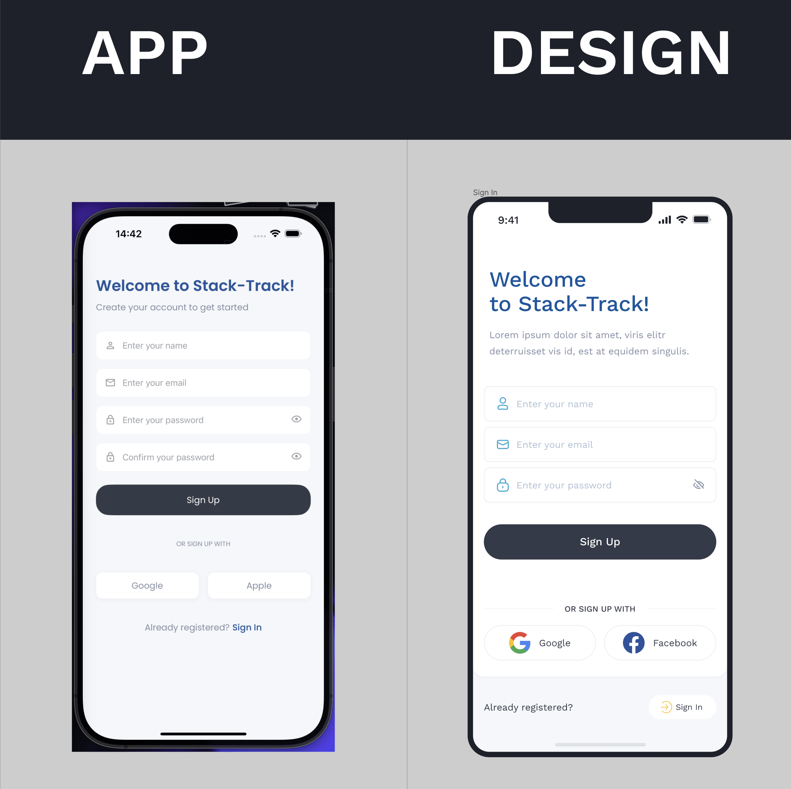
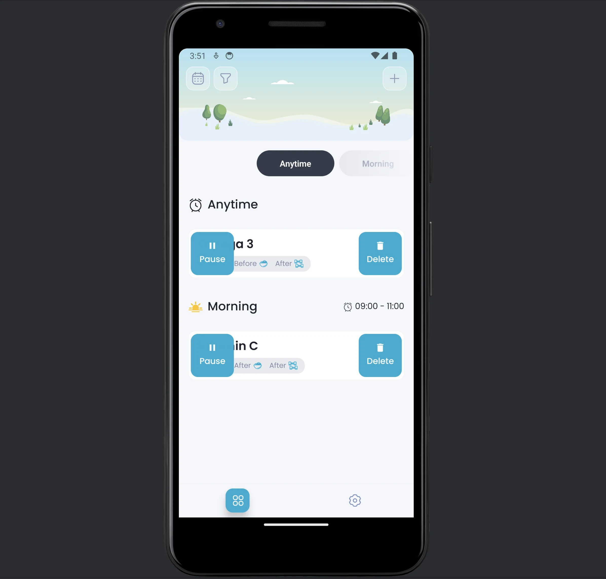

import { LinkCard, Aside } from '@astrojs/starlight/components';

When checking the compliance of user interfaces with figma design, a lot of inconsistencies were found.
In fact, every screen does not match the design.

## IOS

The IOS version of the application is working and performs the basic functionality of the application. However, it has very significant differences from the design.

Here is a comparison of the first screen. You can see the rest of the screens by clicking on the link below the image.

<LinkCard
    title="Link to Figma design"
    description="Check IOS application vs Figma design"
    href="https://www.figma.com/design/yMqntDMkA5A8kyFKcLJwz3/Stack-Track---Dose-%26-Timing?node-id=4259-23490&t=PkiGeRsG7Zve2aok-1s"
    target="_blank"
/>

## Android

I didn't do a compliance check for the Android version because it just doesn't work as it should.
There are a lot of bugs, performance issues, and other problems.

<Aside type="caution" title=' '>
    At the moment, the Stack-Track app does not have support for the Android version. To fix this, we need to make significant changes to the code base
</Aside>

