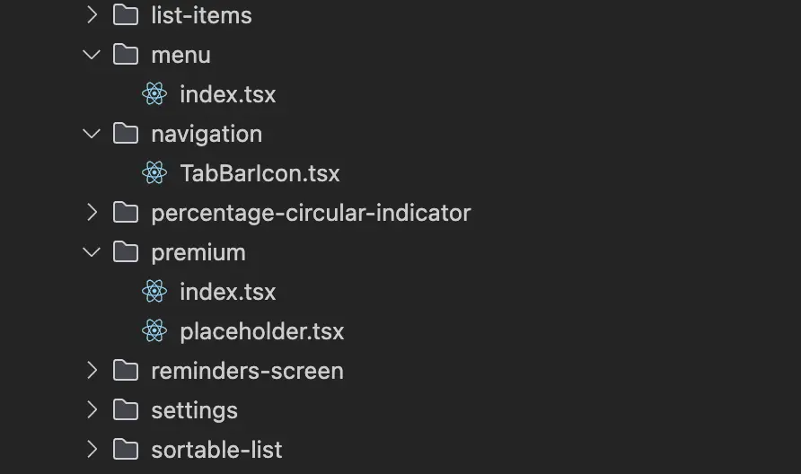
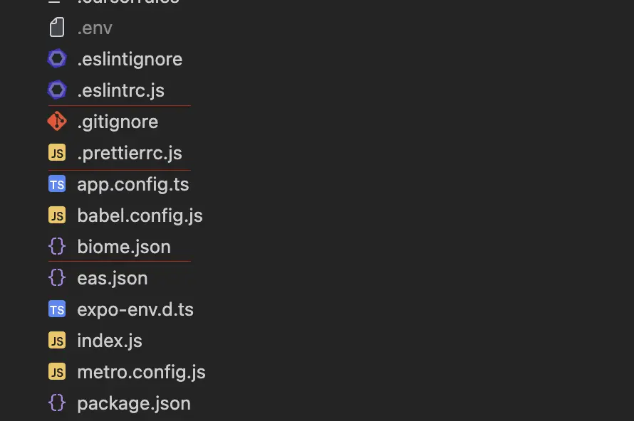

Although the project is declaratively built on the principles of Modular Architecture, a detailed analysis reveals significant deviations from this architecture: illogical placement of modules, mixing of responsibilities, incorrect organization of components and utilities, which violates the basic principles of modularity.

Specific problems:
- Violation of module encapsulation: Modules are not completely self-contained, with cross-dependencies between them, which contradicts the principle of modularity.
- Inconsistent placement of components: Some components are located in common directories (`components/`), although they logically belong to specific modules.
- Mixing business logic and UI: There is no clear separation between business logic and UI components within modules.
- Incorrect placement of utilities: Utilities related to specific modules are located in the general `utils/` directory, which makes it difficult to understand their purpose. And vice versa, exporting utilities that are placed in a specific module outside of that module and using it in a group of others.
- Lack of clear boundaries between modules: Modules do not have clearly defined public APIs, which leads to uncontrolled access to internal components.

Below is a brief overview of these issues

## Mismatch in the way component files are organized

There is a constant discrepancy in the way React component files are organized in the project.

**Three different approaches are used:**
1. A separate file with the component (for example, `TabBarIcon.tsx`).
2. Folder with the `index.ts` file for barrel export (for example, premium/index.ts, which exports `placeholder.tsx`).
3. The `index.tsx` file containing the component itself (for example, menu/index.tsx).

**Problems with this approach:**

- The lack of a single standard makes it difficult to navigate and maintain the code.
- It is not clear how to import a component in different cases.
- Can lead to confusion when refactoring or extending functionality.

## Duplication of linting tools

Three tools for static analysis and code formatting are simultaneously configured and used in the project: Biome (`.biome.json`), ESLint (`.eslintrc.js`), and Prettier (`.prettierrc.js`).

These tools perform similar functions and are interchangeable, which leads to redundancy, potential conflicts, and inefficiency in the development process.

Recommendation: Choose one main tool, Biome or ESLint + Prettier.