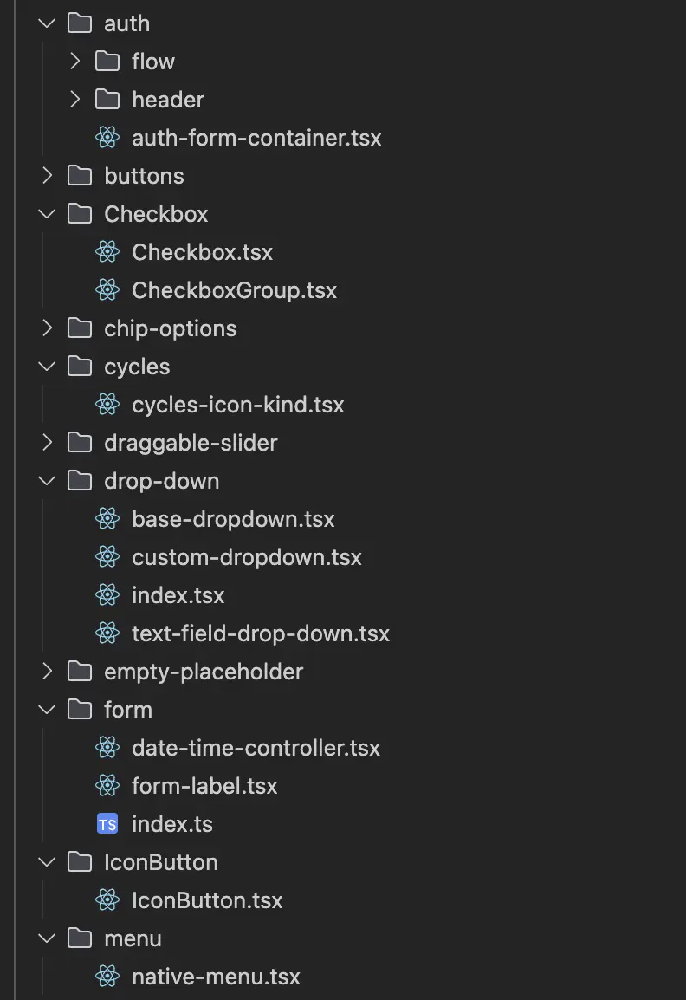
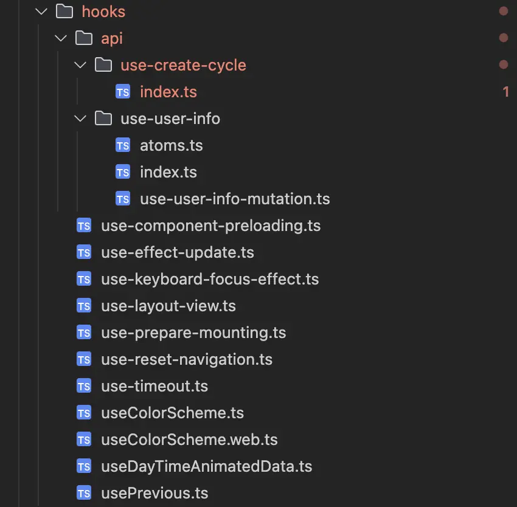

import { Aside, Code } from '@astrojs/starlight/components';
import  codeExample  from './code/options.js?raw';
import commetsExample from './code/cmt.tsx?raw'
import commets2Example from './code/cmtOne.tsx?raw'

This section covers errors related to code style consistency and file naming.

## Excessive amount of commented code

The project files contain a large amount of commented code and comments that are not directly related to the functionality of the components.
Or comments left by AI agents after generation.

These comments contain links to external resources (Patreon), personal notes of the developer, component history, and other metadata that are not relevant to understanding the code.

Reasons why this is not ok:
1. **Professional standard:** production code (especially in the master branch) should not contain excessive comments, personal notes, or links to external resources that are not related to the project.
2. **Reduced code readability:** excessive comments, especially those that are not directly related to functionality, make it difficult to understand the code and its purpose.
3. **Increasing the size of the code base:** commented code and excessive comments increase file size without adding functionality.
4. **Violation of the DRY (Don't Repeat Yourself) principle:** documentation should be stored in specialized places (JSDoc, README, project documentation) and not duplicated in the code.

For example, the files `animated-count.tsx` and `BoundaryGradient.tsx` is provided.

<Code code={commetsExample} lang="tsx" title="animated-count.tsx" />
<Code code={commets2Example} lang="tsx" title="BoundaryGradient.tsx" />

## Mistakes in components naming

There is an inconsistency in the naming of React components in the project - some components are named with a lowercase letter (camelCase) and others with a capital letter (PascalCase).
This violates generally accepted naming conventions.

The official React documentation recommends capitalizing components (PascalCase).
<Aside type="caution" title=' '>
    This is not only a stylistic recommendation, but also a **functional requirement**, since React distinguishes custom components from native HTML elements by the first capital letter.
</Aside>

## Mistakes in hook naming
Inconsistent naming of hook files: there is no single naming convention.

Some files are not consistent with each other (`useColorScheme.ts` vs. `useColorScheme.web.ts`), others do not follow the common kebab-case pattern (`useDayTimeAnimatedData.ts`, `usePrevious.ts`). They are written in camelCase, while the rest of the hooks are written in kebab-case.

The `use-create-cycle` hook is placed in a separate folder, but instead of the hook itself, it contains the `index.ts` file. This can make it difficult to navigate and use the hook, as the folder name alludes to a specific hook rather than a module with multiple files.

It is necessary to unify the names to ensure consistency across the codebase.
Most hooks are written in kebab-case, but some files use camelCase or PascalCase. This breaks the consistency in the project.

## Errors in file names for utility modules

The project has frequent violations of the file naming convention for utility modules (constants, helpers).

For example, the `DropdownOptions.ts` file uses PascalCase (with a capital letter), although it contains only ordinary variables and constants, not React components or classes. According to common conventions, files with utility functions, constants, and helpers should use camelCase (lowercase).

<Code code={codeExample} lang="ts" title="DropdownOptions.ts" />

