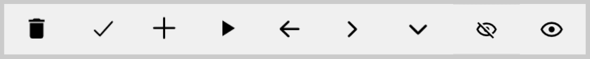
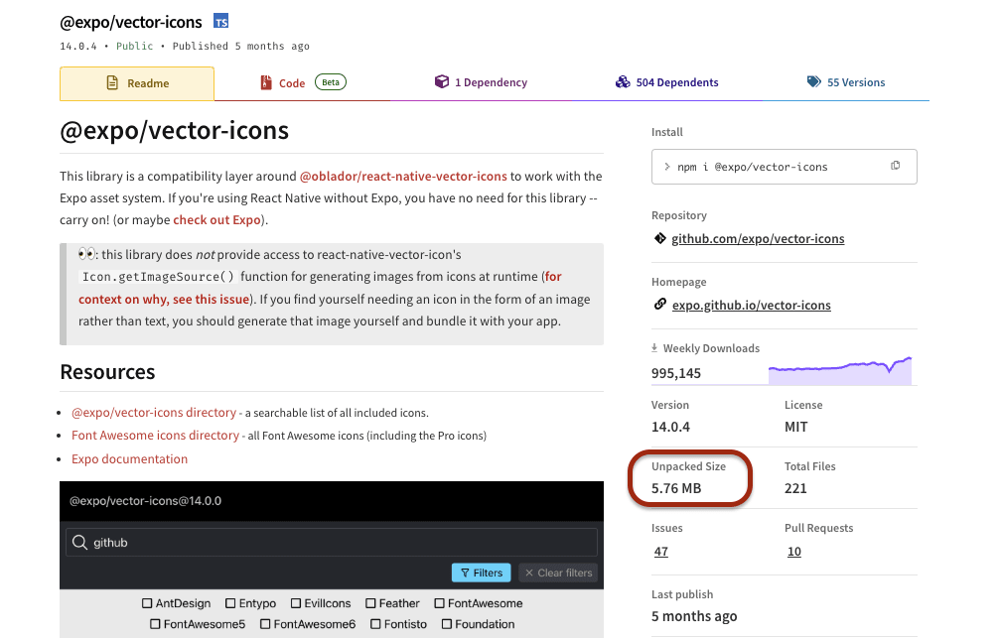
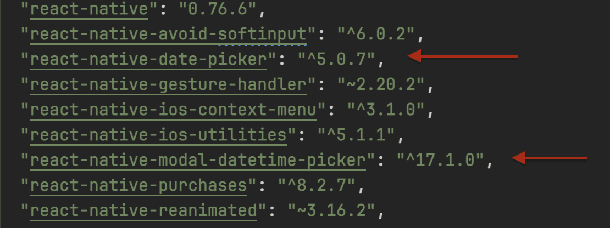
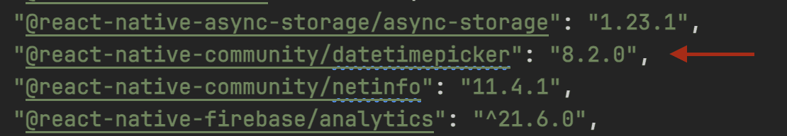
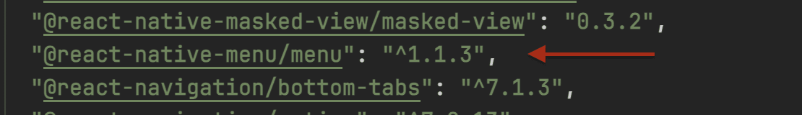
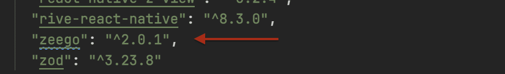
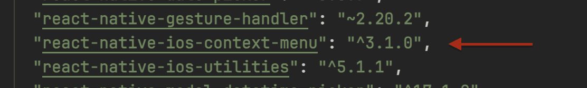

This section covers issues related to the incorrect, improper, or redundant use of libraries within the application. It highlights cases where dependencies are either unnecessary, misconfigured, or could be replaced with more efficient alternatives.

## No need to use a @expo/vector-icons

Code analysis has shown that the `@expo/vector-icons` library, weighing 5.76 MB, which contains thousands of icons from various sets (FontAwesome, MaterialIcons, Ionicons, etc.), is used in the project only to display these 9 icons:

This is not a rational use of the library, which leads to an increase in the size of the application.
Despite the fact that these icons are provided in the figma design

## Date pickers

The project simultaneously uses three different libraries to pick the date and time:
- `@react-native-community/datetimepicker` - the official component from the React Native Community
- `react-native-modal-datetime-picker` - a wrapper over the first component with a modal interface
- `react-native-date-picker` - a third-party component with additional features

## Menu

The project uses 3 libraries for the context menu at once. It is worth checking the feasibility of such use.

- `@react-native-menu/menu`
- `react-native-ios-context-menu`
- `zeego`

